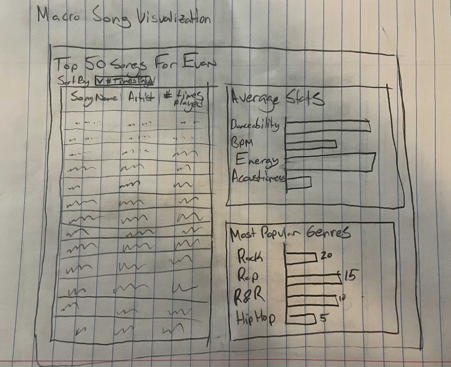
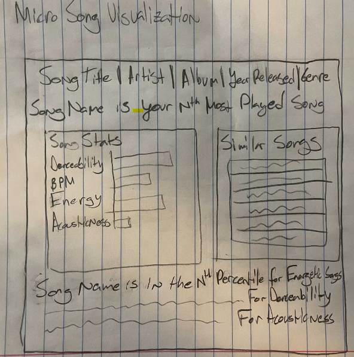
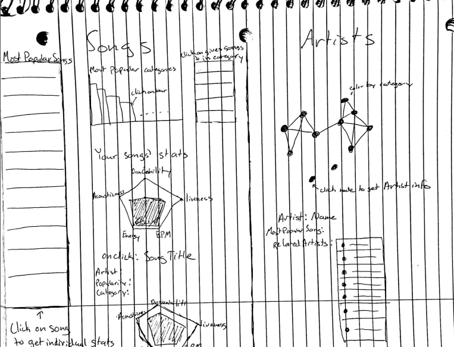
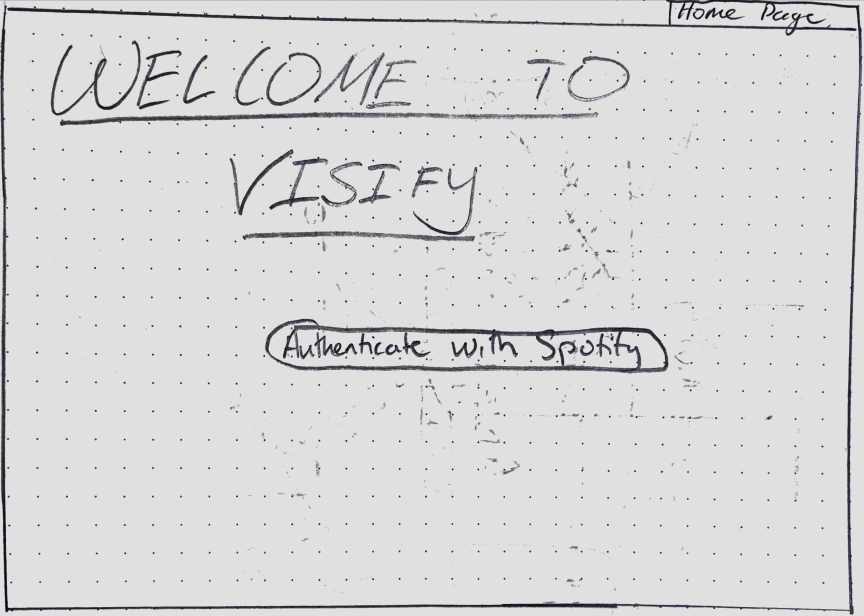
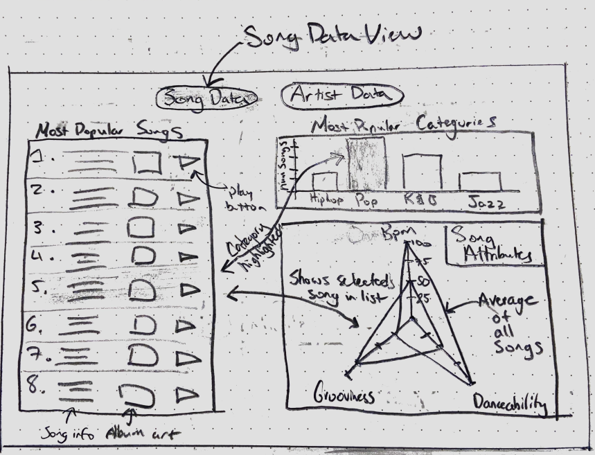
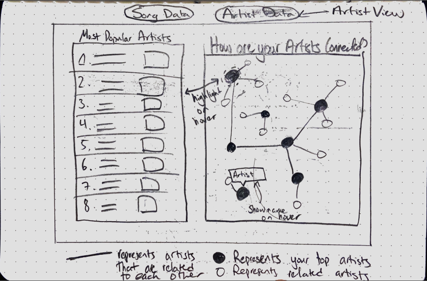
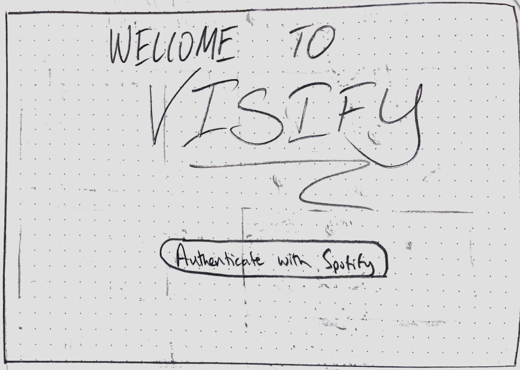
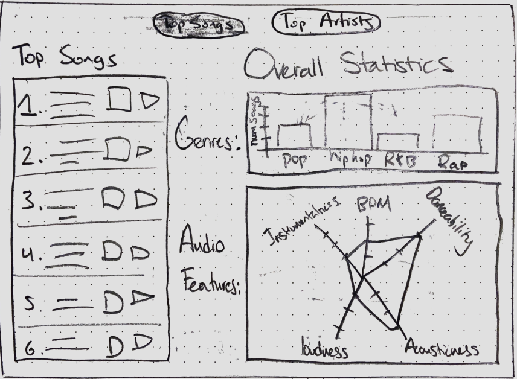
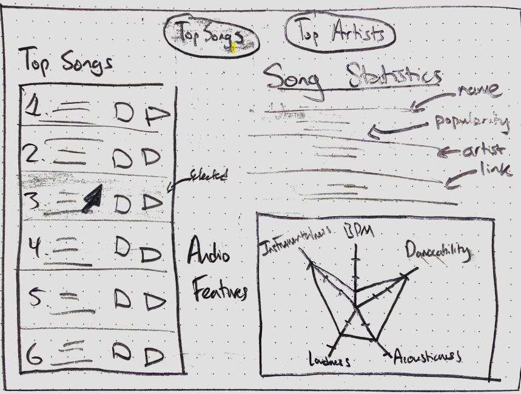
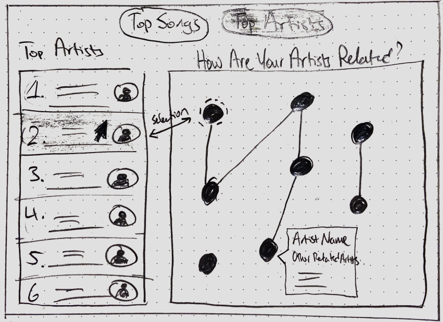

# Final Project Proposal

[TOC]

## Basic Info

**Project Title:** Visify

**Names, Email Addresses and IDs:** 

- Michael Lo, 466267, m.lo@wustl.edu
- Evan Molyneaux, 457888, evanmolyneaux@wustl.edu
- Austin Tolani, 448717, austin.tolani@wustl.edu

[**Project Repository Link**](https://github.com/austintolani/Visify)

## Background and Motivation

Every year Spotify releases a “year in review” to its users. The “year in review” shows a user their top songs, how much music they played, and how much a user listened to their top artist. We want to give users a more detailed look into their Spotify account. Our visualization would also allow them to access it any time, rather than just once a year. Additionally, we will create a visualization that allows the user to explore their Spotify history in much more depth.  The idea to use the Spotify API was from Austin Tolani, who had already done some work with the Spotify API and saw its potential to make a visualization with. We also know Spotify is very widely used, thus our project would be interesting and useful to a large demographic.

## Project Objectives

*“What kind of music do you listen to?”* is a common question to ask, but many people don’t know how to respond. This is the primary question that our visualization hopes to help the user answer. Our visualization will help you answer by presenting you with a variety of data related to your most popular songs and artists. The visualization will display both the overall statistics (for variables like danceability, loudness, acousticness, etc) and genres of all your popular songs and artists and allow the user to select individual songs or artists to get more information about them. From this information, users will gain a better understanding of their own music tastes, which will help them answer *“What kind of music do you listen to?”* and find new music. 

We hope that through our visualization, the user is able to gain a better understanding of the type of music that they listen to and gain insights about their music taste that they didn't have before. The benefits of such a visualization is clear: it exposes the user to their Spotify data (which is hard to access and stored in a complex, non-human readable format) and allows them to engage and understand this data through visualization. 

## Data

All of the data that we will be using in this project will come from the user's personal Spotify data. We will be accessing/generating this data through [Spotify's Web API](https://developer.spotify.com/documentation/web-api/).  To be more specific, below is a list of the specific types of data we will be using and how we are going to access it through Spotify's API. 

- From the [Personalization](https://developer.spotify.com/documentation/web-api/reference/personalization/) endpoint of the API, we will get a list of the top songs of the user and the top artists of the user from approximately the past 4 weeks. This endpoint allows us to get up to 50 songs and artists. We will likely get 50 songs and approximately 25 artists. 
- From the [Tracks](https://developer.spotify.com/documentation/web-api/reference/tracks/) endpoint of the API, we will get audio features for each track, extracting data such as the acousticness, danceability, energy, instrumentalness, liveness, and more. We will also extract more basic data from this endpoint such a song's artist, album, and genre. 
- From the [Artists](https://developer.spotify.com/documentation/web-api/reference/artists/) endpoint of the API, we will get basic information for each artist like their Spotify page URL and image. We will also get a list of the related artists to each artists that we will use in our graph visualization. 

## Data Processing 

We expect to do relatively minimal data cleanup once the data is extracted from the Spotify API. Most of the data cleanup we will be doing will be to remove any unnecessary fields. Once the data cleanup is completed, we expect to have the following quantities/variables:

- A list of 50 songs representing the users 50 most popular songs from the past 4 weeks. For each song, we expect the following quantities/variables:
- Artist (string)
  - Song name (string)
  - Album (string)
  - Album artwork (link/string)
  - The popularity score (int)
  - Around 4-5 audio features like danceability, loudness,etc. (ints)
  - Genre (string)
  - Spotify song link (link/string)
- A list of ~25 artists representing the user's most popular artists from the past 4 weeks. For each artist, we expect the following quantities/variables:
  - Artist name (string)
  - Artist image (link/string)
  - List of related artists (list of strings)
  - Spotify artist link (link/string)\
- Additionally, once the list of songs is created, we will calculate the average of all audio feature values. So, 4-5 variables representing the average danceability score, average loudness score, etc. 

The data processing will be implemented as an intermediate step between fetching the data from Spotify's API and passing the data to the visualization page. All data processing will be done on the client side in the browser using Javascript.

## Visualization Design

At a very high level there are 5 pieces of data that we would like to display:

1. A user's top songs ranked by popularity. 
2. A user's top artists ranked by popularity. 
3. A summary of the audio features (danceability, acousticness, loudness, etc. ) of the user's top songs. 
4. A summary of the genres of the user's top songs. 
5. A summary of how a user's top artists are related to each other. 

For 1. and 2., a simple list visualization seems best. Since these won't be the focus of our visualization, keeping them as simple as possible is best. A list allows us to show the hierarchal nature of the data and is relatively simple. 

For 3., since all of the audio feature variables are scored on a scale from 0-100, it makes sense to use a visualization that can compare the values of multiple variables. Bar charts and spider charts both come to mind. 

For 4., the underlying data is categorical, so it make sense to use a visualization that is best at displaying categorical data for a single variable. Pie charts and bar charts both come to mind. 

For 5., since the underlying data is about showing relationships between data points, some sort of graph (with edges and nodes) seems best. 

### Design #1

This design features a "macro" and "micro" view for the song data. 

The macro view has the following features:

- A list showing each song, along with artist name, sorted by the number of times played. This type of visual encoding is kept simple so that it doesn't distract from the other two visualizations on the page. 
- A bar chart showing the overall audio feature states for all of the songs. The bar chart is one of the simplest and easiest to understand visual encodings for multiple numeric variables. A bar chart is also used to show the most popular genres. 

The micro view has the following features: 

- Textual features showing the song title, artist, album, year released and more. 
- A bar chart showing the audio feature statistics for the individual song. Justification for this visual encoding is the same as above. 
- A list of similar songs. 

Overall, the visual encodings in this design prioritize extremely simple encodings that would be the easiest for the user to understand. 

### Design #2

This design features all of the visualization on one page. The page is split into two sections: songs and artists. 

In the song section: 

- A similar list as design #1 is implemented. Again, the list is a simple visual encoding that doesn't distract from the other visualizations. 
- A bar chart showing the most popular genres based on the most popular songs. This type of visual encoding was chosen because it is one of the simplest and easiest to understand visual encodings for multiple numeric variables and many people are familiar with this type of visualization. 
- [A spider chart](https://en.wikipedia.org/wiki/Radar_chart) is used to show the audio feature statistics both for all of the songs and for an individual song. This spider chart is used as a visual encoding because it looks interesting and draws in the user and it is suited to comparing multiple quantitative variables, which is exactly what we need in our visualization. 

In the artist section:

- A graph (with nodes and edges) is shown. In this graph, each nodes represents one of the user's top artists and an edge between two artists represents that they are related to each other (Spotify's API tell use this). The graph is used as a visual encoding because it is particular good at showing relationships between data points. It is clear to see what artists are related to each other through this visualization. 
- A list is also shown to show the user's top artists in textual format. 

### Design #3

Design #3 has many some similarities to the previous two visualization so I will only describe what is different:

- All of the visualizations exists on a single page and the user can switch between "song data" and "artist data"  using the two buttons at the top. 
- For the spider chart, instead of having two different radar charts for all of the songs and each specific song, these are combined into one spider chart with two lines. This encoding could perhaps make it easier for the user to compare between the two, however it also makes the visualization look more cluttered. 
- In the artist graph, not only are the top artists shown, but the related artists (which are not top artists) are also drawn in, albeit using smaller circle. This feature could allow the user to explore and discover new artists more easily. 

### Final Design 

We feel that our final design combines all of the best features and visual encodings from our initial 3 sketches. At a high level, the final design has the following features:

- Two buttons at the top that allow the user to switch between the "Top Songs" view and the "Top Artists" view. 
- In the "Top Songs" view, there is one view for overall statistics for all songs and then another view for an individual song, triggered by selected the song on the list on the right. 
- In the "Top Artists" view, a list of most popular artists is shown, along with a graph showing how artists are related. 

In terms of visual encodings,

- A list was used to show the most popular songs and artists. As mentioned before, because there are many visualizations on our website, we wanted to make this visualization as simple as possible. The list displays all of the necessary data in the simplest way. 
- A bar chart was used to show the songs by genre. This is a very simple but effective way to show a categorical variable and it is a visualization that most people are familiar with. 
- A spider or radar chart is used to show the different audio features of the songs (or an individual song). We used this visual encoding for two key reasons. First, it provides some visual interest to draw in the viewer. Second, it is a particularly effective visualization to use when comparing multiple variables. This is because the viewer can easily remember the shape of the "web" and compare it to other "webs". Since we want the user to compare the overall song statistics to each individual song, we think this is an appropriate visualization. 
- A graph (with nodes and edges) was used to show how the different artists are related to each other. In this graph, each nodes represents one of the user's top artists and an edge between two artists represents that they are related to each other (Spotify's API tell use this). The graph is used as a visual encoding because it is particular good at showing relationships between data points. It is clear to see what artists are related to each other through this encoding. 

## Must Have Features

The following is a list of our must have features. Without these features, we would consider our project to be a failure:

- Users can log in to their Spotify account to authorize our application to access their Spotify data. 
  - Separate pages for login and visualization. 
- Be able to access the user's Spotify data using the Spotify API.
- Display the user's top songs. 
  - This list should be sorted by each song's popularity to the user along with the song name, artist and album name. 
- Two visualizations that show a summary of the user's top songs. 
  - The first visualization (likely a bar chart) will show which genres are most common in the user's top songs. 
  - The second visualization (likely a spider chart) will show the average audio features across all songs (danceability, loudness, etc. ).
- Display the user's top songs. 
  - This list should be sorted by each artist's popularity to the user.
- One visualization that shows the user's top artists. 
  - This will likely be a force directed graph which shows how the user's top artists are related to each other. 

## Optional Features

Below is a list of the features we would consider to be nice to have, but not critical:

- In the list of the user's top songs, also show album artwork and a sample audio clip of each song. 
- In the artist visualization, allow the user to see artists that are not in their top artists, but are related to their top artists. 
- In the song visualizations, clicking or hovering over a song should render a separate spider chart for just that specific song. 

## Project Schedule

We have agreed that we would like to get most of the project done before the Winter break which is why we have a condensed timeline. 

| **Week**    | Deadlines                                     | **Objectives**                                               |
| ----------- | --------------------------------------------- | ------------------------------------------------------------ |
| 11/16-11/22 | –                                             | - Initialize React application and set up repository (Austin).  - Create a page for Spotify authentication and have this working (Austin)  - Create fetch calls to Spotify’s API to pull down data. (Austin) - Start data wrangling (Austin). - Create working visualization prototypes. (Michael) - Start/add to process book. (Evan) - Define color scheme (Evan) |
| 11/23-11/29 | Milestone 1(11/23)                            | - Finish data wrangling/processing steps. (Austin)  - Continue working on visualization prototypes (Austin, Evan, Michael) - Start to connect data to visualizations (Evan, Michael). - Implement some system for dynamic layout (Evan).  - Create all verbiage elements of the website (e.g instructions, descriptions) (Michael) |
| 11/30-12/6  | –                                             | - Add to process book (Evan). - Finish all visualizations so that we have a fully functional visualization prototype (Austin, Evan, Michael).   - Perform some sort of testing on the application (Michael). |
| 12/7-12/14  | Milestone 2 (12/7)  Presentation (12/14) | - Create presentation (Austin, Michael, Evan)  - Add optional features (Austin, Michael, Evan)  - Fix any lasting problems/bugs (Austin,Michael, Evan) |