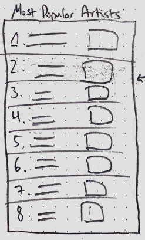
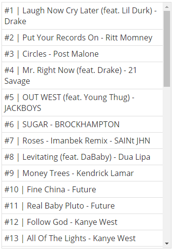
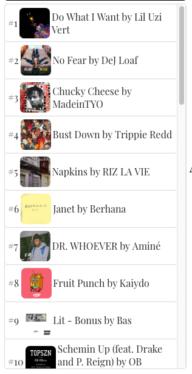
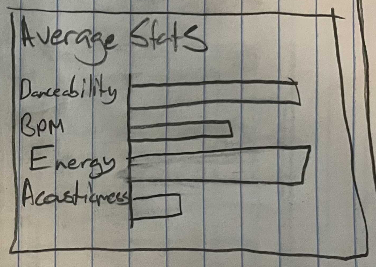
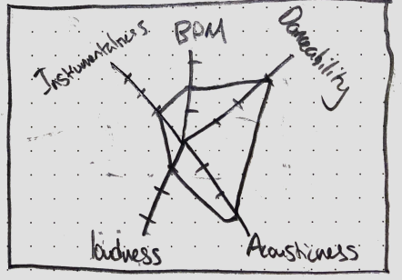
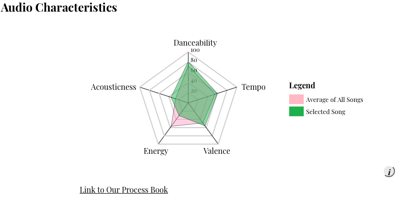
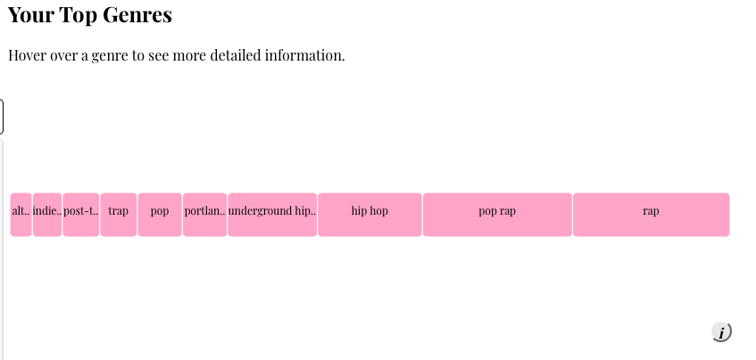
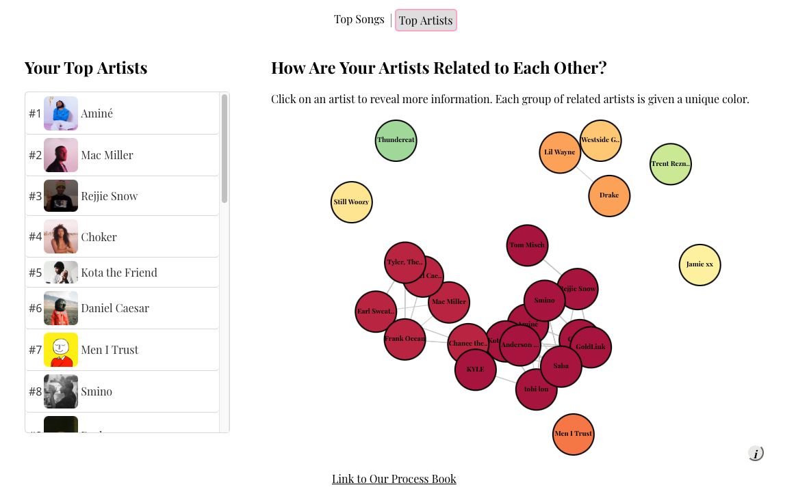
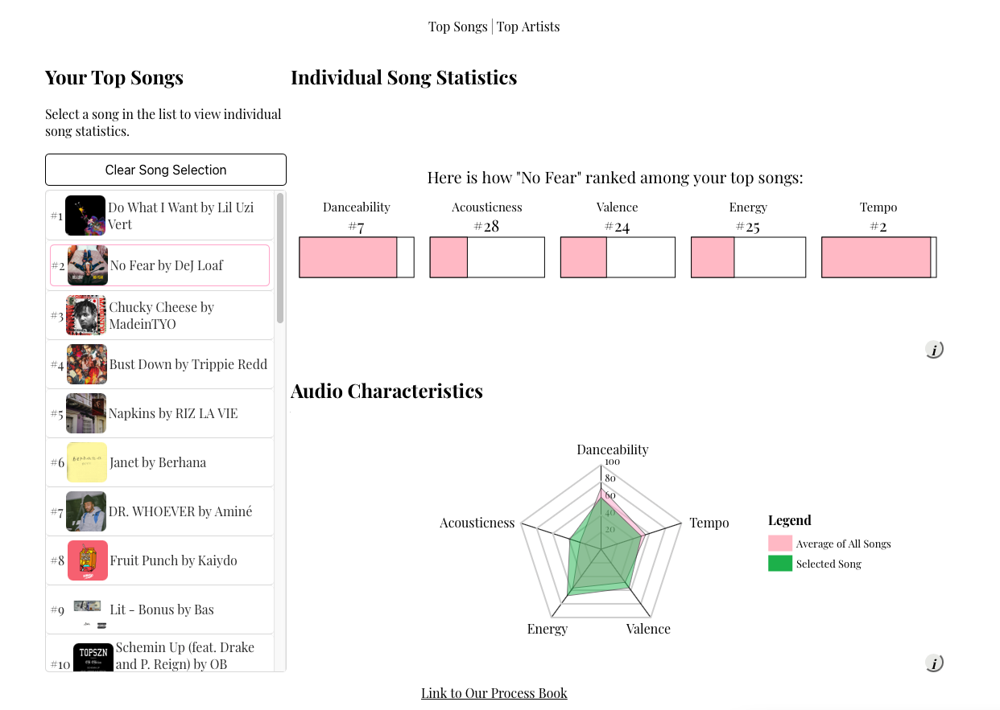

# Visify Process Book

Welcome to our process book for our final visualization project, Visify. Created by Austin Tolani, Michael Lo, and Evan Molyneaux. 

[TOC]

## Overview and Motivation

>  Provide an overview of the project goals and the motivation for it. Consider that this will be read by people who did not see your project proposal.

Every year, Spotify allows their users to explore the artists,songs, and podcasts that defined their year through [Spotify Wrapped](https://www.spotify.com/us/wrapped/). This has been received extremely well by Spotify users and is a great example of an effective interactive visualization. We love Spotify Wrapped, but we think that we can improve it in two key ways. Frist, instead of only being able to view the visualization once a year, we want to create a visualization that can be accessed at anytime and examines your listening history for a smaller time frame. Second, we want to create a visualization that allows the user to explore their listening history in much greater detail, making use of the variety and interactivity of visualizations that we have learned as a part of this course. 

Our goal for this project is to create a visualization that will allow users to log in to their Spotify account and explore their listening history through the use of effective, interactive visualizations. We hope that through the insights gained from our visualization, users are able to learn more about the type of music they listen to! With Spotify being so widely used, we think our project will attract the interest of a large demographic. 

## Related Work

> Anything that inspired you, such as a paper, a website, visualizations we discussed in class, etc.

The following is a list of various visualizations, websites, or other resources that inspired us: 

- [accountanalysis](https://accountanalysis.app/) – A visualization built using D3 that visualizes data related to twitter accounts. This inspired us to start thinking about using a popular website's API to visualize user data. 
- [Spotify Wrapped](https://www.spotify.com/us/wrapped/) – Spotify's yearly visualization that they create so that users can explore the artists, songs, and podcasts they listened to that year. We all agreed that exploring our music listening history was very interesting and this prompted us to focus our project on data generated from Spotify. 
- [D3 Graph Gallery Spider Chart](https://www.d3-graph-gallery.com/spider#:~:text=A%20radar%20or%20spider%20or,values%20over%20multiple%20quantitative%20variables.&text=Spider%20charts%20can%20be%20tedious,number%20of%20elements%20composing%20them.) – When browsing ways to visualize our data, we came across the spider chart in the D3 Graph Gallery. We thought that this could be an effective way to visualize and compare different audio features across songs. 
- [Spotify's Developer Showcase](https://developer.spotify.com/community/showcase/web-apps/) – A curated page of web applications that use Spotify's API. This gave us a lot of inspiration and idea as to how we could use Spotify's API. 

## Questions

> What questions are you trying to answer? How did these questions evolve throughout the project? What new questions did you consider in the course of your analysis?

At the time of the inception of the project, the main question that we are trying to answer is: ***"what kind of music do I listen to?"***. Related to this question are a list of sub-questions:

- What were the songs that I have listened to the most? 
- What are the genres of the songs that I have listened to the most?
- Besides for genre, what are other ways to summarize the type of songs I have been listening to? We will try and answer this question by using the different audio feature values given be the Spotify API for each song. Examples of audio features include instrumentalness, danceability, loudness, and more. 
- What are the artists that I have listened to the most? 
- How are the artists I listened to related to each other?

## Data

> Source, scraping method, cleanup, etc.

### Source/Scrapping Method

All of the data that we will be using in this project will come from the user's personal Spotify data. We will be accessing/generating this data through [Spotify's Web API](https://developer.spotify.com/documentation/web-api/).  To be more specific, below is a list of the specific types of data we will be using and how we are going to access it through Spotify's API. 

- From the [Personalization](https://developer.spotify.com/documentation/web-api/reference/personalization/) endpoint of the API, we will get a list of the top songs of the user and the top artists of the user from approximately the past 4 weeks. This endpoint allows us to get up to 50 songs and artists. We will likely get 50 songs and approximately 25 artists. 
- From the [Tracks](https://developer.spotify.com/documentation/web-api/reference/tracks/) endpoint of the API, we will get audio features for each track, extracting data such as the acousticness, danceability, energy, instrumentalness, liveness, and more. We will also extract more basic data from this endpoint such a song's artist, album, and genre. 
- From the [Artists](https://developer.spotify.com/documentation/web-api/reference/artists/) endpoint of the API, we will get basic information for each artist like their Spotify page URL and image. We will also get a list of the related artists to each artists that we will use in our graph visualization. 

To get the data, we will follow the [Implicit Grant Flow](https://developer.spotify.com/documentation/general/guides/authorization-guide/#implicit-grant-flow) suggested by Spotify to have the user provide temporary authorization to our web application. We can use the authorization token from this interaction to make subsequent calls to the Spotify API on behalf of the user. 

Because of the number of calls we make to the Spotify API in a short amount of time, rate limiting is a concern. To solve this, we have implemented delays of several seconds in our API calls to make sure we don't go over the rate limit. This means that the data collection process will last around 10-15 seconds. 

### Data Cleaning

When the data is initially pulled from the Spotify API, it contains many unnecessary fields. Additionally, we need to perform a series of joins and subsequent calls to the API to get additional data for each song/artist. This is all done before any data is passed to any of the visualizations. 

The following is the code we used to get and clean the data from the Spotify API: 

```javascript
/**
 * This function outputs the cleaned Spotify data.
 * @param {string} accessToken The user's access token
 */
async function outputCleanedData(accessToken,setSongData,setArtistData) {
    // Initialize and authorize Spotify
    var spotifyApi = new Spotify();
    spotifyApi.setAccessToken(accessToken);

    // // Get Top Tracks
    let topTracks = await spotifyApi.getMyTopTracks({ "limit": numTopSongs, "time_range": timeRange });
    // Get Top Artists
    let topArtists = await spotifyApi.getMyTopArtists({ "limit": numTopArtists, "time_range": timeRange });

    // Create new songs array and populate with cleaned song data
    let songs = [];
    for (let i = 0; i < topTracks.items.length; i++) {
        await delay(500);
        let song = topTracks.items[i];
        const trackId = song.id;
        //Create array of genres
        let songGenres = new Set();
        // Create array of artists
        let artists = new Array();
        song.artists.forEach(async artist => {
            artists.push(artist.name);
            let artistObject = await spotifyApi.getArtist(artist.id);
            artistObject.genres.forEach(genre => {
                songGenres.add(genre);
            })

        })

        // Get audio features for the track
        let audioFeatures = await spotifyApi.getAudioFeaturesForTrack(trackId);

        // Filter data
        let songData = {
            "name": song.name,
            "songLink": song.external_urls.spotify,
            "popularity": song.popularity,
            "audioPreview": song.preview_url,
            "albumName": song.album.name,
            "artists": artists,
            "albumArt": song.album.images[0].url,
            "genres": Array.from(songGenres),
            "audioFeatures": {
                "acousticness": audioFeatures.acousticness,
                "danceability": audioFeatures.danceability,
                "energy": audioFeatures.energy,
                "instrumentalness": audioFeatures.instrumentalness,
                "liveness": audioFeatures.liveness,
                "loudness": audioFeatures.loudness,
                "speechiness": audioFeatures.speechiness,
                "valence": audioFeatures.valence,
                "tempo": audioFeatures.tempo
            }
        };
        // Append to songs array
        songs.push(songData);
    }

    // Create new artists array and populate with cleaned artist data
    let artists = [];
    for (let i = 0; i < topArtists.items.length; i++) {
        let artist = topArtists.items[i];
        const artistId = artist.id;
        await delay(500);
        // Get related artists
        let relatedArtists = await spotifyApi.getArtistRelatedArtists(artistId);
        // Filter related artist data
        let relatedArtistsFiltered = relatedArtists.artists.map(artist => {
            return {
                "name": artist.name,
                "artistLink": artist.external_urls.spotify,
                "artistId": artist.id,
                "artistImage": artist.images[0].url,
                "genres": artist.genres,
            }
        })
        // Filter data
        let artistData = {
            "genres": artist.genres,
            "name": artist.name,
            "artistLink": artist.external_urls.spotify,
            "popularity": artist.popularity,
            "artistImage": artist.images[0].url,
            "artistId": artistId,
            "relatedArtists": relatedArtistsFiltered

        }
        //Push filtered data element into artists array
        artists.push(artistData);
    }

    return {"songData":songs,"artistData":artists};


}
```


### Final Data Format

The following list is all of the variables that our cleaned dataset will contain, along with a description for each variable. Currently, the final dataset contains two JSON objects: `songData` and `artistData`. 

Currently, two pieces of data are outputted when the user is authenticated: song data and artist data. 

**Song Data**

The following is a list of fields in `songData`:

- `name` The name of the song.
- `songLink` The URL to open the song in Spotify
- `popularity` The popularity of a track is a value between 0 and 100, with 100 being the most popular. The popularity is calculated by algorithm and is based, in the most part, on the total number of plays the track has had and how recent those plays are.
- `audioPreview` A link to a 30 second preview (MP3 format) of the track. Can be `null`.
- `albumName` The name of the album.
- `artist` An array of artist names.
- `albumArt` The link to an image of the album artwork.
- `genres` An array of strings which represents the genre categories of all of the artists featured on a song. Genres are not duplicated. Note that this list could be empty if Spotify hasn't classified the artists. 
- `audioFeatures` an object containing the following fields:
- `acousticness` A confidence measure from 0.0 to 1.0 of whether the track is acoustic. 1.0 represents high confidence the track is acoustic.
  - `danceability` Danceability describes how suitable a track is for dancing based on a combination of musical elements including tempo, rhythm stability, beat strength, and overall regularity. A value of 0.0 is least danceable and 1.0 is most danceable.
  - `energy` Energy is a measure from 0.0 to 1.0 and represents a perceptual measure of intensity and activity. Typically, energetic tracks feel fast, loud, and noisy. For example, death metal has high energy, while a Bach prelude scores low on the scale. Perceptual features contributing to this attribute include dynamic range, perceived loudness, timbre, onset rate, and general entropy.
  - `instrumentalness` Predicts whether a track contains no vocals. “Ooh” and “aah” sounds are treated as instrumental in this context. Rap or spoken word tracks are clearly “vocal”. The closer the instrumentalness value is to 1.0, the greater likelihood the track contains no vocal content. Values above 0.5 are intended to represent instrumental tracks, but confidence is higher as the value approaches 1.0.
  - `liveness` Detects the presence of an audience in the recording. Higher liveness values represent an increased probability that the track was performed live. A value above 0.8 provides strong likelihood that the track is live.
  - `loudness` The overall loudness of a track in decibels (dB). Loudness values are averaged across the entire track and are useful for comparing relative loudness of tracks. Loudness is the quality of a sound that is the primary psychological correlate of physical strength (amplitude). Values typical range between -60 and 0 db.
  - `speechiness` Speechiness detects the presence of spoken words in a track. The more exclusively speech-like the recording (e.g. talk show, audio book, poetry), the closer to 1.0 the attribute value. Values above 0.66 describe tracks that are probably made entirely of spoken words. Values between 0.33 and 0.66 describe tracks that may contain both music and speech, either in sections or layered, including such cases as rap music. Values below 0.33 most likely represent music and other non-speech-like tracks.
  - `valence` A measure from 0.0 to 1.0 describing the musical positiveness conveyed by a track. Tracks with high valence sound more positive (e.g. happy, cheerful, euphoric), while tracks with low valence sound more negative (e.g. sad, depressed, angry).
  - `tempo` The overall estimated tempo of a track in beats per minute (BPM). In musical terminology, tempo is the speed or pace of a given piece and derives directly from the average beat duration.

**Artist Data**

  The following is a list of fields in `artistData`:

- `genres` An array of genres related to the artist

- `name` The name of the artist

- `artistLink` The Spotify link of the artist

- `popularity` The popularity of the artist. The value will be between 0 and 100, with 100 being the most popular. The artist’s popularity is calculated from the popularity of all the artist’s tracks.

- `artistImage`  A link to an image of the artist

- `artistId` A unique id for the artist

- `relatedArtists` An array of related artists objects, each of which contain the following fields:
  - `genres` An array of genres related to the artist
  - `name` The name of the artist
  - `artistLink` The Spotify link of the artist
  - `artistImage` A link to an image of the artist
  - `artistId` A unique id for the artist

## Exploratory Data Analysis

> What visualizations did you use to look at your data initially? What insights did you gain? How did these insights inform your design?

Because most of our data is textual in nature and any related numerical data was very easy to understand, we did not necessarily need to do much exploratory data analysis. The bulk of our "exploratory data analysis" involved looking through the [Spotify Web API Reference Documentation](https://developer.spotify.com/documentation/web-api/reference/) to see what type of data we could generate using the API and how we could join this data to the user's top songs and artists. 

The insights that we gained from our exploratory data analysis certainly informed our final design. By seeing what data was available, this directly informed what visualizations we were going to create. For example, we found that the Spotify API has an [endpoint](https://developer.spotify.com/documentation/web-api/reference/tracks/get-audio-features/) that will return different audio features for a specified song. Audio features include acousticness, danceability, instrumentalness and more. Given that we had several numerical variables all on the same scale (0-1), this influenced our design decision to implement a spider chart. 

## Design Evolution

> What are the different visualizations you considered? Justify the design decisions you made using the perceptual and design principles you learned in the course. Did you deviate from your proposal?

At a very high level there are 5 pieces of data that we would like to display:

1. A user's top songs ranked by popularity. 
2. A user's top artists ranked by popularity. 
3. A summary of the audio features (danceability, acousticness, loudness, etc. ) of the user's top songs. 
4. A summary of the genres of the user's top songs. 
5. A summary of how a user's top artists are related to each other. 

For 1. and 2. we considered many visualizations such as a bar chart, word cloud and circular bar plot. Ultimately, we decided that putting the songs in a list (ranked by popularity) would be best. This if for a couple reasons. First, it is extremely simple and very easy for the user to understand. Second, since these elements will be the "entry point" for interactivity with the other visualizations on the page, we wanted to make sure it was simple and easy to understand. Finally, for each song or artist we want to show several pieces of data including an image,ranking, and text. We felt that a list gives us the biggest canvas to show this data effectively.  The following images are sketches that we drew of what the list could look like for artists and songs. 




This is an initial version of the list in our visualization:



This is what the list currently looks like in our visualization:




For 3, since all of the audio feature variables are scored on a scale from 0.0-1.0, it makes sense to use a visualization that can compare the values of multiple variables. Bar charts and spider charts both come to mind. We ended up choosing a spider chart because it will provide visual interest to our visualization and secondly it makes it really easy to compare values across songs.  The first image below is an intial sketch of what the data could look like in a bar chart. The following image is a sketch of a spider chart. 





This is what the first iteration of the diagram looked like:


Below is what the diagram currently looks like. Note that we added the functionality to show two different sets of data. This allowed for an effective way to compare values between different datasets. 



For 4, we initially thought to create a simple bar chart that would show which genres were the most popular. After some feedback, we realized this was too simple and we adjusted it was a visualization that resembles a word cloud, however instead of words we are using circles. Each circle represents a genre and a larger circle area corresponds to a more popular genre. Once we implemented this visualization however, we realized that it was really hard to perceive the difference in areas between the circles. 

So, instead we visualized this information using a row chart. We chose this visualization largely because of the design principles we learned in the course. Namely, using this method significantly increasing the Data-Ink ratio as we no longer are wasting ink on the axis and labels. These data will all be shown inside of each rectangle, with more information being shown on hover. The following is the resulting visualization:



One of the pieces of feedback we got after our prototype was that the row chart looked like a series of buttons. To fix this, we removed the rounding on the rectangles. 


For 5, since our underlying data is about showing relationships, it makes sense to use a visualization hat is best at displaying relationships between data points. Using a force-directed graph (where nodes represent the artist and edges represent a connection between artists) seems like the best type of visualization for this data. The following image is a sketch we drew showing what this graph could look like. 


The following is what the visualization ended up looking like:




## Implementation

>  Describe the intent and functionality of the interactive visualizations you implemented. Provide clear and well-referenced images showing the critical design and interaction elements.

### Homepage

The home page of the visualization introduces the user to the application and provides two options for entry: connect their own Spotify account or use sample data. Both of these entry points are represented by buttons that are styled and have hover effects. 


In our user testing, we noticed people wanted to know about the time frame of the data we were collecting. Initially, the time range was set on the back-end and was not changeable by the user. After this feedback, we added the option for the user to select the time frame from the home screen, as well as information about what the different time frames represent. 


### Loading Screen

Fetching and processing the data from the Spotify API takes several seconds. Because we didn't want the user to be waiting without any feedback, we implemented a loading screen which is in and of itself a visualization. While the various songs and artists are pulled from the api, the image associated with the song or artist is placed randomly on the screen, and fades in using a transition. This creates a cool collage of album art and artist images that progressively contains more and more images. 


Additionally, when the loading screen is shown, the audio of the user's most listened to track is played. We added this feature because we are showing data that is inherently linked to sound, and we wanted to include this aspect in our visualization. Note that this feature only works on a Google Chrome or Chromium based web browser. 


### Top Songs View

This view allows the user to explore all of the visualizations related to their top songs. The fixed interaction point is the list that appears on the left of the application. This is a sorted list of the top songs of the user with each element of the list showing the rank, artist name, song name and album art. Clicking on a song in the list will "select" the song. If a song is selected, it is highlighted. There is a button to clear the selection. 

**All Songs View**

If no song is selected, the visualization looks like this:


There is a row chart showing the top genres found in the users top songs and a spider chart showing the average audio characteristics of the top songs. Hovering over the row chart shows a detailed breakdown of the popyularity of the genre, in terms of percentage and count. 

**Selected Song View**

If a song is selected, the Top Genres visualization is hidden an replaced with a selected song visualization show individual song statistics. It looks like this:



The individual song statistics visualization shows how that specific song ranks, in terms of audio characteristics, against the other top songs. You will also not that the spider chart now has an additional "web" appended to it, showing the audio characteristics of the selected song. This allows the user to easily compare how the audio characteristics of the selected song compare to all of their songs. 


### Top Artists View

This view shows visualizations related to the user's top artists. Similar to the Top Songs view, the main interaction point is the ranked list of artists. Click on an artist will select the artist, causing the "Selected Artist" element to render, which shows a picture of the artist, their name, and a link to their Spotify page. Selecting the artist from the list will also highlight the artist in the relationship diagram. Clicking on the artist in the relationship diagram has the same effect as selecting from the list. 

The main visualization in this view is the relationship diagram. This shows how your top artists are related to each other. For every artist, Spotify maintains a small list of related artist. In order for a line to be drawn between two artists in the diagram, one of the artists must by on the related artist list of the other artist. The user can interact with this visualization by selecting an artist or alternative by dragging and rearranging the position of nodes in the diagram. 


### Other Features

#### More Information Button

You will notice that in the bottom right of each visualization there is an information button. Clicking on this button will bring up a popup that provides more information about what the visualization is showing and the underlying data. This is not needed to understand each visualization but is there in case the user is more curious. This is what the popup looks like:


#### Styling

Having a visualization with consistent fonts and colors was very important. One of the things we learned through this class is the importance of design. We used the following color scheme. We chose this color scheme by drawing inspiration from the Spotify green and going from there. 


## Evaluation

> What did you learn about the data by using your visualizations? How did you answer your questions? How well does your visualization work, and how could you further improve it? 

This was a very fun project to work on which led to many conversations about the music that people listen to.  Since the data used for the visualization was dynamic (changed with every user), there is no single conclusion about what we learned about the data from our visualization. With that said, generally, we found that while people have a good idea of the type of music they listen to, many were surprised to see the results of quantifying their listening history. For example, several of the people we tested on were surprised that they listened so much to a particular artist or genre. 

The main question that we were trying to answer was: ***"what kind of music do I listen to?"***. Related to this question was a list of sub-questions:

- What were the songs that I have listened to the most? 
- What are the genres of the songs that I have listened to the most?
- Besides for genre, what are other ways to summarize the type of songs I have been listening to? We will try and answer this question by using the different audio feature values given be the Spotify API for each song. Examples of audio features include instrumentalness, danceability, loudness, and more. 
- What are the artists that I have listened to the most? 
- How are the artists I listened to related to each other?

Our visualization certainly answers these questions. In the song view, we created visualizations that clearly show the user's most listened to songs, most popular genres based on those songs and the different audio features of the songs they listen to. In the artist view we created a visualization that allows the user to clearly see what artists they listened to most and how their artists are related to each other (depicted in a force directed graph).

With regard to how we could improve upon our visualization, we have identified three key areas of improvement:

1. Creating a site that is mobile responsive. We found that many of the people we were sharing the visualization with opened the link on a mobile device. Our site is dynamic, but is certainly not optimized for a mobile browser. This would be a good area to improve the project. 
2. Improving the style of the application. We did not have much experience in design and think that we did a decent job of creating a visually appealing website, but this certainly could be improved. 
3. Browser compatibility. Through testing, we found that certain features did not work or worked sub optimally. For example, D3 transitions in our loading screen on Safari was really choppy. Another example was that the audio that is played in the loading screen does not play in non Chrome based browser. We could improve our project by continuing to test features on different browsers and optimize for the different browsers. 